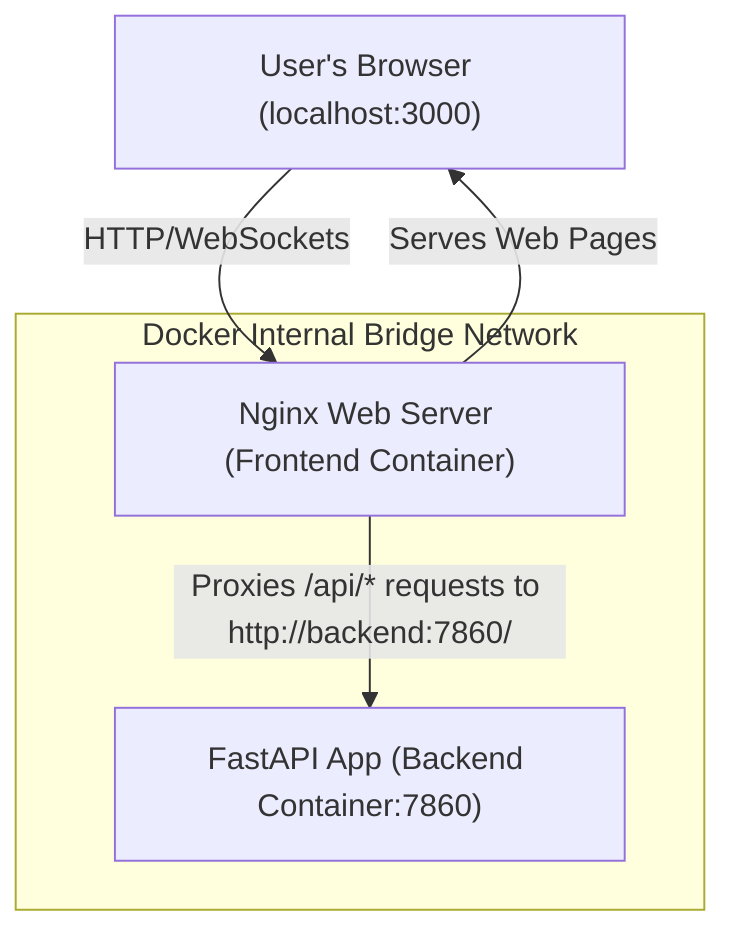

# 🛡️ AEGIS: An Intelligent Digital Twin Framework for Vehicle Health Monitoring and Predictive Maintenance

Welcome to **AEGIS** (An Intelligent Digital Twin Framework for Vehicle Health Monitoring and Predictive Maintenance). This project provides a full-stack, real-time diagnostic console and API designed to monitor EV motor status, inspect tyre structural health using advanced AI object detection, and predict Remaining Useful Life (RUL) of mechanical systems.

This repository contains the **React (Vite) Frontend** and container orchestration configurations. Its sibling repository, **IIT_Project**, houses the **FastAPI Backend** and machine learning/deep learning model weights.

---

## 🏗️ System Architecture & Communication Flow

AEGIS utilizes a multi-container stack inside a unified Docker network:



* **Frontend Container**: Compiles static React/Vite assets and serves them via an **Nginx Web Server** on port `3000`. It also acts as a reverse proxy, routing requests to `/api` directly to the backend.
* **Backend Container**: Runs a **FastAPI** application on port `7860`, executing real-time ML inference (Tyre AI, EV Motor telemetry, and sensor anomaly diagnostics).
* **Internal Routing**: Client browsers communicate with the Nginx server. Nginx forwards requests internally to the backend using Docker's internal DNS resolving name (`http://backend:7860`). This avoids cross-origin resource sharing (CORS) problems completely.

---

## 📋 Prerequisites for Beginners

Before launching the project, make sure you install the following utilities on your host system:

1. **Docker Desktop**:
   - [Download for Windows/macOS/Linux](https://www.docker.com/products/docker-desktop/)
   - *Windows Users*: Make sure you install **WSL 2 (Windows Subsystem for Linux)** during installation and enable the WSL 2 integration in Docker Desktop Settings.
2. **Git**:
   - [Download Git](https://git-scm.com/downloads)
3. **Node.js (Optional - Only for local development)**:
   - [Download Node.js v20.19+ / v22.12+](https://nodejs.org/)

---

## 🚀 Quick Start: Running with Docker Compose (Recommended)

Docker Compose allows you to spin up the entire application stack (both Frontend and Backend) with a single command.

### Step 1: Clone the Repositories
Create a folder named `IIT-Dhanbad-Project` (or any workspace folder) and clone both repositories side-by-side so they are siblings:
```bash
# Clone the Frontend & Compose Repository
git clone https://github.com/prakarsh68/iit-dhanbad-project.git IIT_DigitalTwin

# Clone the Backend Repository
git clone https://github.com/prakarsh68/iit-dhanbad-backend.git IIT_Project
```

Your folder layout **must** look like this:
```
IIT-Dhanbad-Project/
├── IIT_DigitalTwin/  <-- (This Repository) Contains React, Nginx, docker-compose.yml
└── IIT_Project/      <-- Contains FastAPI app: api.py, models, weights
```

### Step 2: Build & Start the Containers
Open a terminal inside the `IIT_DigitalTwin` folder and run:
```bash
docker compose up --build -d
```
* **`--build`**: Compiles the React production assets and downloads backend Python dependencies.
* **`-d`**: Runs the containers in the background (detached mode).

### Step 3: Access the Applications
Open your browser and navigate to the following addresses:

| Interface | URL | Description |
| :--- | :--- | :--- |
| 💻 **AEGIS Web Console** | [http://localhost:3000](http://localhost:3000) | Main React-based digital twin control center. |
| ⚙️ **Backend Health Root** | [http://localhost:7860](http://localhost:7860) | Verifies the FastAPI application status. |
| 📄 **API Documentation** | [http://localhost:7860/docs](http://localhost:7860/docs) | Interactive Swagger UI to inspect and test backend API endpoints. |

### Step 4: Stop the Services
To shut down and stop the containers, run:
```bash
docker compose down
```

---

## 🛠️ Local Development (Without Docker)

If you prefer to run and modify the source code live with hot-reloads, you can run the services natively.

### Running the React Frontend
1. Open a terminal in `IIT_DigitalTwin`.
2. Install dependencies:
   ```bash
   npm install
   ```
3. Run the development server:
   ```bash
   npm run dev
   ```
4. Open [http://localhost:5173](http://localhost:5173) in your browser.

### Running the FastAPI Backend
1. Open a terminal in `IIT_Project`.
2. (Recommended) Create and activate a virtual environment:
   ```bash
   python -m venv .venv
   # Windows:
   .venv\Scripts\activate
   # macOS/Linux:
   source .venv/bin/activate
   ```
3. Install dependencies:
   ```bash
   pip install -r requirements.txt
   ```
4. Run the FastAPI application:
   ```bash
   uvicorn api:app --host 127.0.0.1 --port 7860 --reload
   ```

---

## 📱 Mobile App Synchronisation & Builds

The project is pre-configured with **CapacitorJS** to wrap the React web assets into native mobile applications for Android and iOS.

### Step 1: Build and Sync Web Assets
Anytime you modify the React components, compile the code and push it to the mobile platforms:
```bash
npm run cap:sync
```
This runs `npm run build` and automatically moves the generated static HTML/CSS/JS into the native `android/` and `ios/` folders.

### Step 2: Compile for Android (APK)
* **Open in Android Studio**:
  ```bash
  npm run cap:open-android
  ```
  This loads the project in Android Studio. From there, select **Build > Generate Signed Bundle / APK...** or click the run button to test on an emulator.
* **Compile via Command Line (Windows/Linux)**:
  Open a terminal inside the `android/` folder and run:
  ```bash
  .\gradlew.bat assembleDebug
  ```
  The compiled APK will be output to: `android/app/build/outputs/apk/debug/app-debug.apk`.

### Step 3: Compile for iOS (.ipa)
*Note: iOS compilation requires a macOS device with Xcode and CocoaPods installed.*
1. Open the project in Xcode:
   ```bash
   npm run cap:open-ios
   ```
2. In Xcode, configure your developer signature in **Signing & Capabilities**.
3. Select your target device and click **Run** (Play icon) or press `Cmd + R` to compile.

---

## ❓ Troubleshooting & FAQs

### 🛑 Error: "Read-only file system" (WSL 2 / Windows Users)
If you run out of physical disk space on your `C:` drive, WSL 2 will automatically lock down the virtual filesystem as read-only.
1. Free up at least **15–20 GB** on your `C:` drive.
2. Shutdown and restart WSL to release the lock:
   ```powershell
   wsl --shutdown
   ```
3. Restart **Docker Desktop** and rebuild the containers using `docker compose up --build -d`.

### 🔌 Error: API requests fail / CORS errors when not using Docker
If running the frontend natively (`npm run dev`) and it cannot connect to the backend:
- Check that `IIT_DigitalTwin/.env` contains the correct API endpoint, e.g.:
  `VITE_API_BASE_URL=http://localhost:7860`
- Confirm that your FastAPI backend is running on port `7860`.
